{{ page.date | date_to_string }}

## Features

| Feature | ZecWallet | NightHawk | ZWallet
| --- | --- |
| **Sending to** | 
| Shielded | &#x2022; | &#x2022; | &#x2022;
| Transparent | &#x2022; | &#x2022; | &#x2022;
| **Receiving into** |
| Shielded | &#x2022; | &#x2022; | &#x2022;
| Transparent | &#x2022; | &#x2022; | &#x2022;
| **Spending from** |
| Shielded | &#x2022; | &#x2022; | &#x2022;
| Transparent | &#x2022; | ? | &#x2022; (1)
| **Balance** |
| Confirmed | &#x2022; | &#x2022; | &#x2022;
| Unconfirmed | &#x2022; (2) | &#x2022; | &#x2022;
| **Price Feed** | &#x2022; | &#x2022; | &#x2022;
| **Transaction History** | &#x2022; | &#x2022; | &#x2022;
| **View in Block Explorer** | &#x2022; | ? | &#x2022;
| **Memo** | | &#x2022; | &#x2022;
| **View Only Account** | ? | | &#x2022;
| **Custom Server** | | &#x2022; | &#x2022;
| **Multiple Accounts** | | | &#x2022;
| **Progress Status (Tx Building)** | &#x2022; | | &#x2022;
| **Tx amount in USD** | &#x2022; | ? | |
| **QR Code Scanner** | &#x2022; | &#x2022; | &#x2022;
| **Diversified Addresses** | | | &#x2022;
| **Max Amount per Note**| | | &#x2022;
| **Color Themes** | | | &#x2022;
| **Light/Dark Themes** | | | &#x2022;
| **Customizable Anchor Offset** | | | &#x2022;
| **Note Display** | | | &#x2022;
| **Coin Control** | | | &#x2022;
| **Spending Chart** | | | &#x2022;
| **Balance History Chart** | | | &#x2022;
| **Address Book (Contacts)** | | | &#x2022;
| **Sync Speed** (3) |
| Android One (4) | ~7 mn | N/A | ~3 mn
| PC (5) | ~5 mn 20 s | N/A | ~25 s
| **Platform** |
| Android | &#x2022; | &#x2022; | &#x2022; Jelly Bean |
| iOS | &#x2022; | &#x2022; | &#x2022; iOS 9.0 (6) |

Notes:
1. Must be shielded before
2. Upcoming version
3. Results depend on the wallet 
4. Test performed on an old wallet (approx 200 txns dating back to block 846200)
with an Nokia Android One (by @ChileBob). NightHawk did not complete the test.
5. Test performed on Desktop PC (AMD 3900X) with a recent wallet (2021-06) and ~50 tx. 
   NightHawk does not provide a command line version for PC.
6. To be released

Minimum Requirements for ZecWallet and NightHawk are not available.

## Quick Start

> Tip: Open in new tab for the original image size

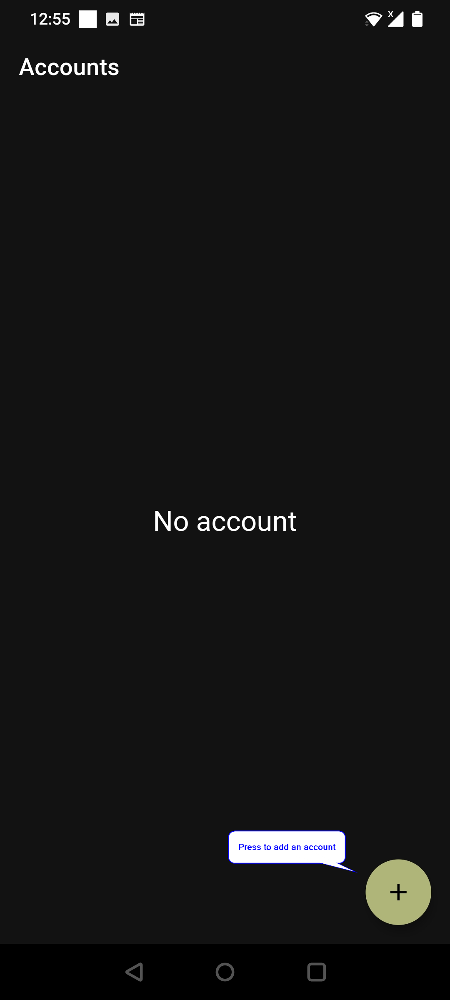
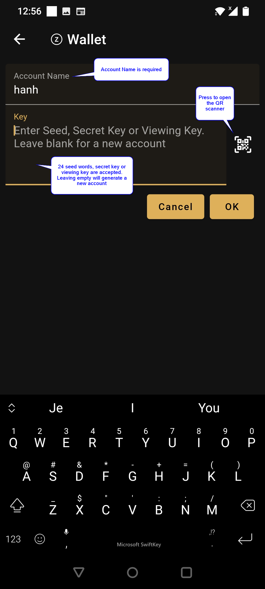
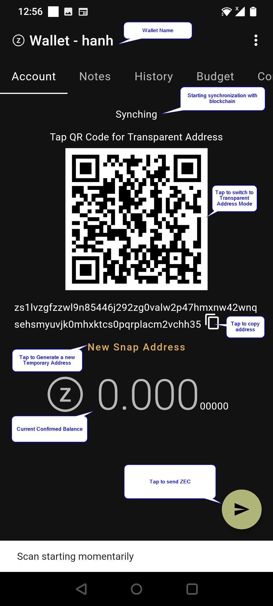

## Receiving

> Tap to switch between transparent and shielded mode

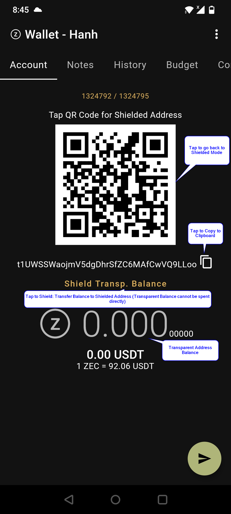

## Sending
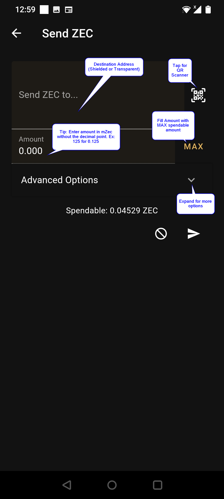
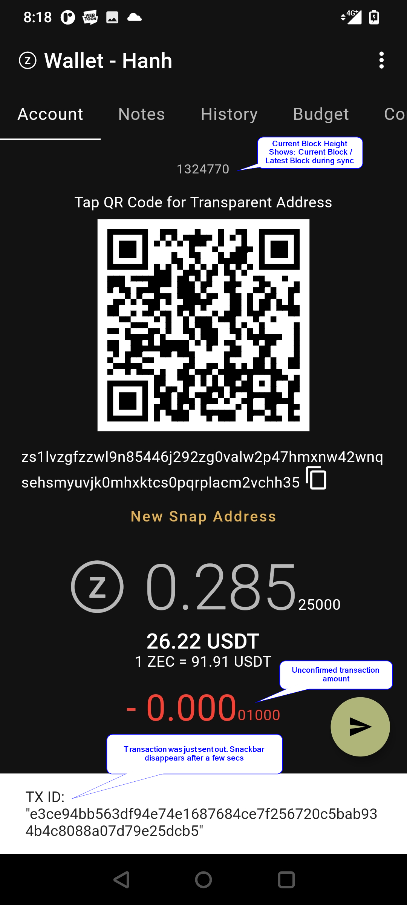
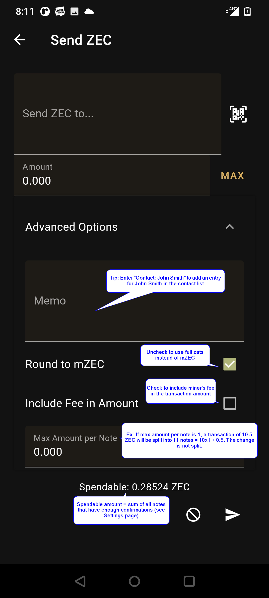

- The transaction is prepared in the background
- There is a progress bar during the preparation of
the transaction

## Menus
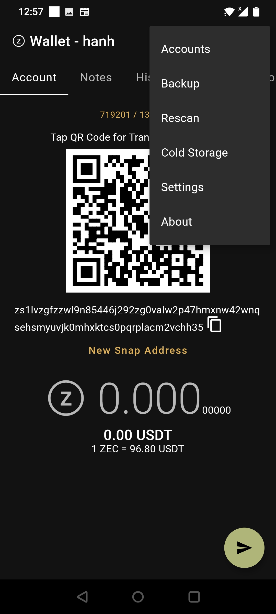

### Account Manager
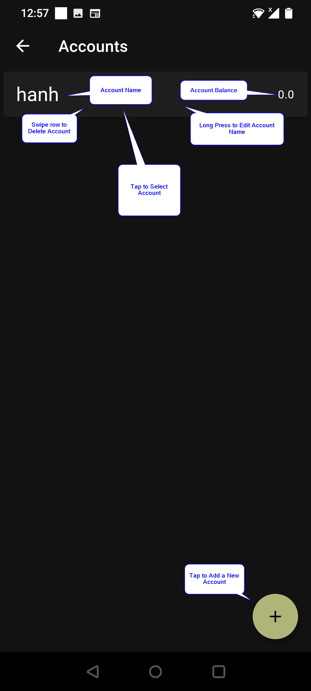

### Backup

> Please, backup your account data as soon
> as possible

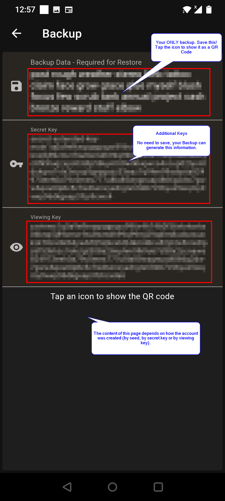

### Application Settings

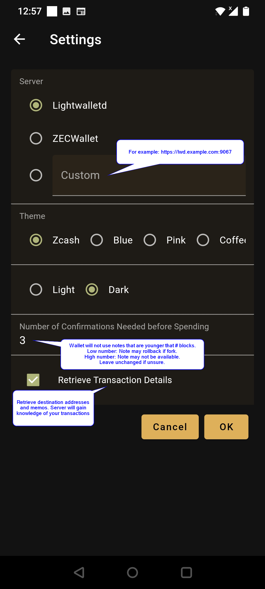

## Tabs

### Notes
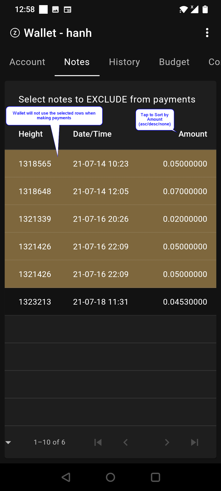

### Transaction History
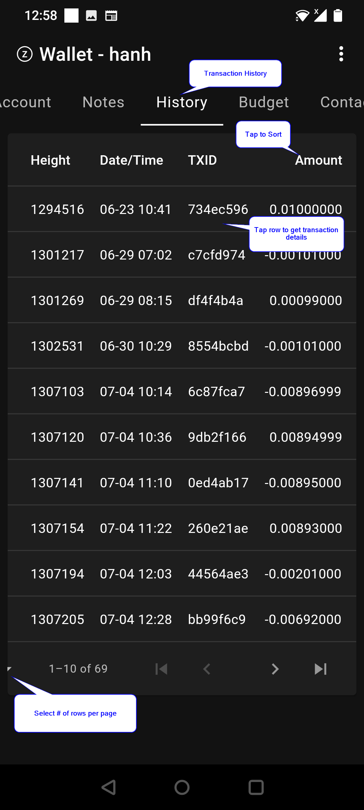
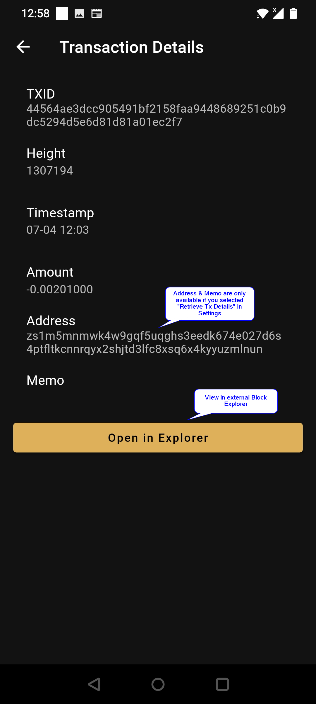

### Budget (Spendings in the last 30 days)
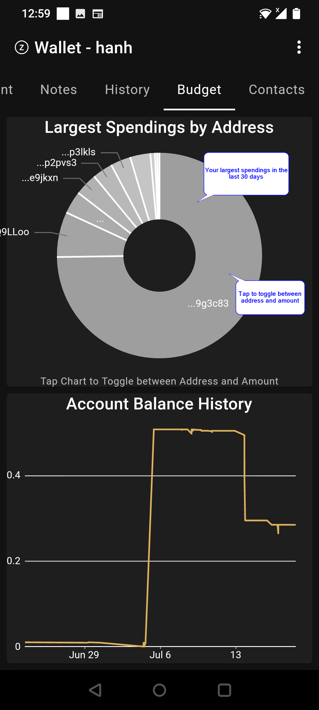

### Contacts

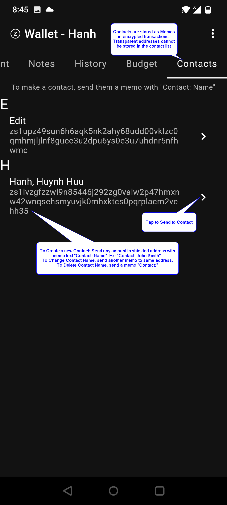

